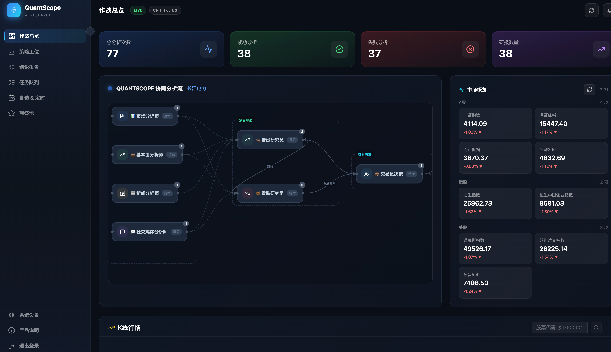
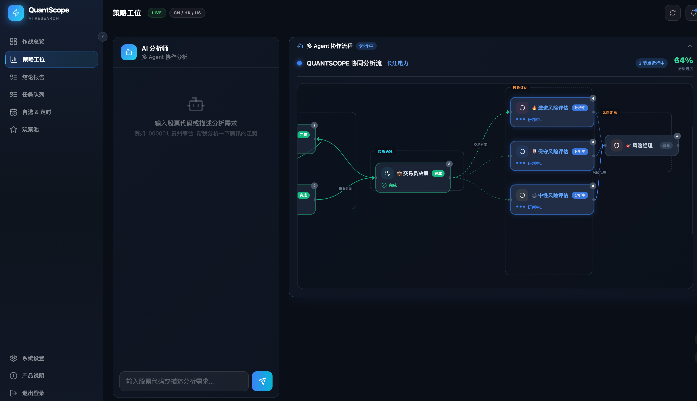
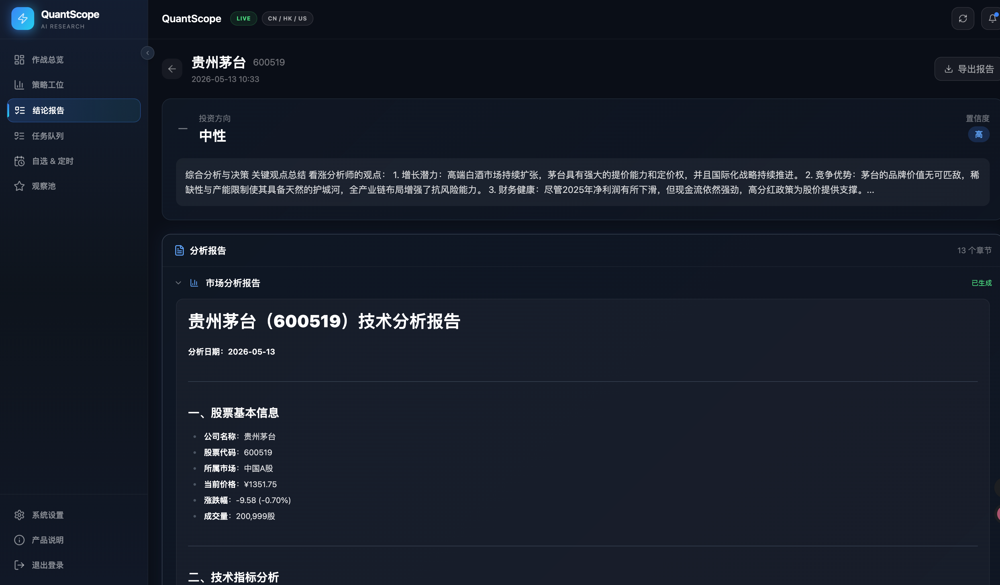
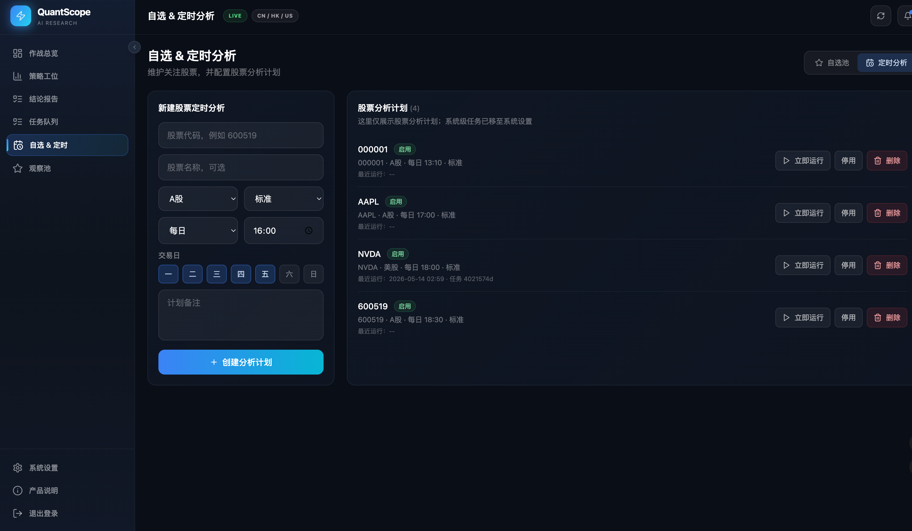

# QuantScope

[](./LICENSE)
[](https://www.python.org/)
[](./VERSION)
[](./docs/)

面向中文用户的 AI 股票研究与分析平台，提供从数据同步、研究流程编排、多模型接入到报告导出的完整工作流。项目定位为学习、研究与策略实验，不提供实盘交易指令，也不构成投资建议。

## 项目定位

QuantScope 重点解决三类问题：

- 用统一界面管理多模型、多数据源、多市场分析任务
- 用可追踪的任务流承载单股分析、批量分析、筛选、报告导出
- 用工程化后端把研究过程、配置、进度、通知和历史记录沉淀下来

## 核心能力

### 分析能力

- **单股分析**：自然语言描述股票（如"帮我分析贵州茅台"），自动提取股票代码，提交深度分析任务
- 多角色协作研究流程：市场、基本面、新闻、社交媒体分析师并行采集，辩论阶段多空双方交锋，风控阶段三重视角评估，最终由交易员和风险经理输出决策
- Markdown / Word / PDF 报告导出
- 历史记录追踪与分析结果回看

### 平台能力

- React 18 + TypeScript + Vite + Tailwind CSS 前端，Zustand 状态管理，TanStack Query 数据获取
- FastAPI + MongoDB + Redis 后端，WebSocket + SSE 实时进度与通知
- 邮箱验证码登录 / 注册，用户认证，操作日志
- 定时分析计划管理（每日/每周/每月）、收藏、自选股
- 配置中心、模型管理、数据源管理、定时任务调度

### 数据与模型

- 支持 A 股、港股、美股等市场场景
- 支持 Tushare、AkShare、BaoStock 等数据源
- 支持 OpenAI、Google、DeepSeek、通义千问等多类模型接入
- 支持自定义 OpenAI 兼容端点

## 前端界面

### 页面一览

| 页面 | 说明 |
|------|------|
| 登录 / 注册 | 邮箱验证码登录流程，支持登录和注册两个模式 |
| 工作台 (Dashboard) | 市场概览、近期任务、分析报告快捷入口 |
| 股票分析 (Analysis) | 自然语言输入 → 自动提取股票代码 → 提交分析 → 实时进度 → 多 Tab 报告查看 |
| 任务中心 (Tasks) | 全部分析任务列表，状态筛选，进度追踪 |
| 报告中心 (Reports) | 历史分析报告，按时间/股票筛选 |
| 自选股管理 | 股票收藏与定时分析计划管理（每日/每周/每月） |
| 系统设置 (Settings) | 用户偏好（邮件报告推送）、系统定时任务管理 |

## 产品截图

| 页面 | 说明 |
|------|------|
|  | **工作台** — 概览数据、市场状态与快捷入口 |
|  | **单股分析** — 输入股票代码，提交深度分析任务 |
|  | **完整报告** — 查看最终研究报告与数据洞察 |
|  | **定时分析** — 配置定时任务，自动化研究流程 |

### 分析流程（AI 分析师协作）

分析任务由多个 AI 角色协作完成，分为四个阶段：

1. **并行采集**：市场分析师、基本面分析师、新闻分析师、社交媒体分析师并发采集数据
2. **多空辩论**：看涨研究员与看跌研究员对立分析，输出完整论据
3. **交易决策**：交易员综合各方观点，给出投资计划和交易方向
4. **风险评估**：激进、保守、中性三重风险视角评估，最终由风险经理汇总

分析完成后，支持邮件报告推送（需在设置中开启 `email_report_enabled`）。

## 技术架构

当前版本以 `FastAPI + React 18 + MongoDB + Redis` 为主架构：

```
QuantScope/
├── app/                    # FastAPI 后端
│   ├── routers/            # API 路由（auth, analysis, scheduler, reports, ...)
│   ├── services/           # 业务服务（分析、邮件、定时任务、通知）
│   ├── models/             # Pydantic 数据模型
│   └── core/               # 数据库、Redis、配置、日志
├── frontend-react/         # React 18 前端（主要 UI）
│   ├── src/
│   │   ├── pages/          # 页面组件（Login, Dashboard, Analysis, Tasks, Reports, ...）
│   │   ├── components/     # 可复用组件（Agent、Charts、Layout、UI）
│   │   ├── services/       # API 客户端（auth, analysis, reports, market, ...）
│   │   ├── stores/         # Zustand 状态管理（auth, app）
│   │   └── lib/            # axios 实例、全局配置
├── tradingagents/          # 分析引擎与多角色研究流程内核
├── web/                    # Streamlit 兼容模块（保留）
└── docs/                   # 部署说明、架构说明、功能说明
```


## 快速开始

### 方式一：Docker Compose

适合大多数体验和部署场景。

启动前建议确认：

- 已安装 Docker Desktop / Docker Engine
- 本机可用端口包括 `3000`、`8000`、`27017`、`6379`
- 已准备好 `.env` 配置，或确认仓库默认配置可用于本地体验

```bash
docker compose build
docker compose up -d
```

查看服务状态：

```bash
docker compose ps
```

查看后端日志：

```bash
docker logs -f quantscope-backend
```

默认访问地址：

- 前端: `http://localhost:3000`
- 后端 API: `http://localhost:8000`
- 健康检查: `http://localhost:8000/api/health`

停止服务：

```bash
docker compose down
```

如果只想重启后端：

```bash
docker compose up -d --force-recreate backend
```

补充文档：

- [Docker 部署文档](./docs/deployment/docker)
- [快速开始](./docs/guides/quick-start-guide.md)

### 方式二：源码运行

适合开发与定制。

基本要求：Python 3.10+、Node.js 18+、MongoDB、Redis

```bash
python -m venv .venv
source .venv/bin/activate
pip install -r requirements.txt
```

前端（React）依赖安装：

```bash
cd frontend-react
npm install
npm run dev
```

后端启动：

```bash
python -m app.main
```

源码运行时默认访问地址：

- 前端开发服务器: `http://localhost:5173`
- 后端 API: `http://localhost:8000`

前端开发模式下会把 `/api` 请求代理到本地后端。

### 常见启动顺序

1. 准备 `.env`
2. 启动 MongoDB 和 Redis：`docker compose up -d mongodb redis`
3. 启动后端：`python -m app.main`
4. 启动前端：`cd frontend-react && npm run dev`
5. 打开 `http://localhost:5173`

## 认证说明

系统使用**邮箱验证码登录**，流程如下：

1. 输入邮箱，点击获取验证码（开发环境直接返回验证码）
2. 输入收到的验证码，完成登录
3. 新用户自动创建账号，用户名格式为 `user_{邮箱前缀}_{随机数}`

默认测试账号：`admin` / `admin123`（用户名密码登录，不支持验证码模式）

邮件报告推送需在**设置 → 偏好设置**中开启 `email_report_enabled`，报告将发送到用户登录邮箱。

## MCP 接入

项目当前已经暴露多组 MCP server。

例如单股分析 MCP endpoint：

```
http://localhost:8000/mcp/analysis/mcp
```

当前 analysis MCP server 暴露的核心 tool 包括：

- `submit_single_analysis`
- `get_final_report`

更详细的 Hermes 接入方式可参考：[Hermes MCP 集成说明](./docs/integration/hermes_mcp_integration.md)

## 使用建议

- 首次使用前，先完成模型配置与数据源配置
- 开始分析前，先执行基础数据同步
- 对需要可比性的任务，固定分析日期、模型组合和市场范围
- 在生产环境优先使用 Docker 和独立数据库实例

## 适用场景

- AI 金融研究学习
- 多模型效果对比
- 数据源接入与分析流程实验
- 内部研究平台原型
- 面向中文用户的研究工具二次开发

## 开发与贡献

欢迎提交 Issue 和 Pull Request。

基础流程：

1. Fork 本仓库
2. 创建分支
3. 提交修改
4. 发起 Pull Request

## 许可证

本项目采用混合许可证，详见 [LICENSE](./LICENSE) 与 [LICENSING.md](./LICENSING.md)。

- 开源部分：除 `app/` 和 `frontend-react/` 外的大部分文件采用 Apache 2.0
- 专有部分：`app/` 与 `frontend-react/` 目录需要依据仓库中的专有许可条款使用

如涉及商业使用、分发或定制合作，请先确认许可证范围。

## 风险提示

本项目仅用于研究、教学与策略实验。

- 不构成投资建议
- 不保证分析结果准确性或收益表现
- AI 输出存在不确定性
- 金融决策请结合专业判断与风险控制

---

如果这个项目对你有帮助，可以给仓库一个 Star。